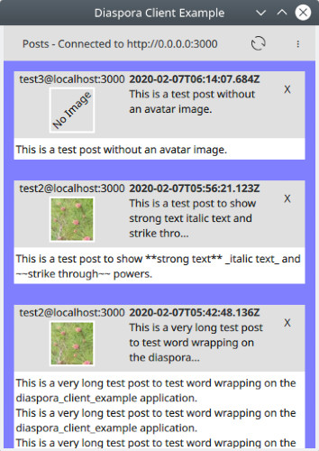

# diaspora_client_example
A basic example of a QML based client for connecting to the diaspora social network.

Thursday January 23, 2020 - With the release of the new HTTPS/JSON based diaspora API the author decided as a personal challenge to see how much of a simple client could be written using QTQuick and QML in the span of 1 day, 2 days, and so on.

Day 2.5 Screenshot:

**Goals:**

* Day 1: Client that authenticates and shows posts.
* Day 2: Filtering posts.

**Day One Design Goals:**

* Credentials / Login
  * Update 13:14 - Finding out that things work way differently than what I assumed from the pieces of documentation read thus far. Things of note:
    * Client will need to connect to the specific pod using the API
    * Client will use OpenID + oauth.
    * API is not web based yet. Not sure how this reconciles with the fact that the API docs use https/url conventions.
    * If a pod does not use HTTPS what port(s) are used for the protocol?
  * Update 13:41 - NodeInfo is a protocol that servers can use to broadcast JSON formatted info about themselves.
    * https://example.com/.well-known/nodeinfo
      * Provides general information + urls for specifcs.
      * Example - https://example.com/nodeinfo/2.0
  * Update 14:02 - OpenID uses NodeInfo-like scheme to get information about the OpenID implementation
    * https://example.com/.well-known/openid-configuration
  * Update 14:22 - Client requests a connection using OpenID "Client Registration Request":
    * POST http://example.com/api/openid_connect/clients
  * Update 18:04 - Stalled on OpenID dev pending access to a *diaspora test environment.
* UI
  * QtQuick + QML
    * Update 18:04 - Done installing and configuring QtCreator, Android SDK, Android NDK and hopefully all the dependencies. Whew. Beginning UI dev via QtQuick mobile scrolling application.
  * Display first page of recent posts.
  * Load additional pages of recent posts.

**Rectangles:**

Top Level Rectangle
 * Refresh Button

Setup Rectangle
 * username/password
 * Sign In button.
 * Log Out button.
 
VScroll Rectangle
 * Post Window
   * Name / Date
   * Post Contents
   
Day 2 Goals TBD
